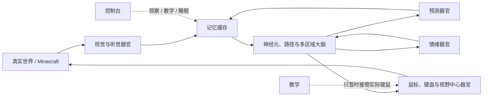

# 人工生命项目 2.5

这是一个以“完整人工生命回环”为基础，探索神经活动、路径传播、人工出生结构、情绪调制、感受与动作如何共同形成生命表现的长期实验项目。

项目不把大脑当作一个接受题目并输出答案的孤立模型。世界、身体、器官、大脑、记忆缓存、教学、睡眠、控制台和运行系统在工程上可以拆分，但在运行逻辑上始终属于同一个人工生命。

> 当前状态：理论已经冻结，第二次实验的外围系统与大规模结构已经形成；正式实验暂停在“大脑运行方式重构”阶段。现有运行结果不代表项目理论已经得到验证。

## 项目的核心问题

这个项目希望逐步回答：

- 没有实体编号、目标标签、答案和奖励时，真实感受活动能否在完整生命回环中形成持续内部结构？
- 大量神经元与路径的微小变化，怎样经过多个组织和区域共同形成宏观行为？
- 画面、声音、动作和身体状态怎样沿先天路径激活情绪器官，并实时影响可塑路径变化？
- 人工出生结构与后天路径状态的复杂干涉，怎样形成个体差异和人格？
- 预测器官能否把大脑内部形成的简化活动重新还原成视觉和听觉？
- 当最终实验加入语言时，语言能否作为完整社会生命活动的一部分被真正理解，而不是作为独立答案模块存在？

## 完整生命回环

这里不存在独立于生命回环的传统训练循环。不同信息流可以异步到达；项目中的“时间”只表示事物发生的先后顺序，不作为数值进入大脑。

## 已冻结的基本关系

### 信号

信号强度只表示正在发生的生命活动，不携带实体编号、目标、词义、答案、任务标签或奖励。

### 神经元

同一神经元接收到的多路普通活动直接相加。神经元按照人工出生结构规定的响应强度形成活动，并在符合阈值时通过所有符合条件的路径传播。放大发生在神经元，不发生在路径。

### 路径

路径是传播关系，不是传统意义上的标量权重。路径越强，传播时保留的活动越多；所有符合条件的路径都会参与，不选择赢家或最佳路径。

- 固定路径来自出生结构，不因经历改变。
- 可塑路径能在实际信号、情绪器官物质活动和出生条件共同满足时形成或增强，并在睡眠时受到固定小量削弱。

### 情绪器官

画面、声音、动作或身体状态先形成神经活动，再沿人工出生结构规定的特殊短路径到达情绪器官。情绪器官输出连续物质活动，但不判断正确、错误、奖励、惩罚或好坏。

物质活动只能按照出生时已经存在的受体关系，改变神经元当前有效响应、阈值以及可塑路径的变化程度。

### 人工出生结构

人工出生结构描述区域组织、神经元属性、固定路径、器官连接、调制受体分布和可塑路径形成空间。个体出生后保持不变；经历改变的是同一个体的后天路径状态。

人格不作为名称或参数直接写入，而被定义为情绪器官所连接的先天结构与后天路径状态之间的复杂干涉关系。

## 统一公式

项目把某个发生顺序位置上的完整生命状态记为：

\[
\mathcal L=(W,B,C,U,A,Q,P,M,Y,R)
\]

下一项真实外部或内部发生记为 \(\varepsilon\)，全部变化统一受以下关系约束：

\[
\boxed{
\mathcal L^{+}=\Phi_D(\mathcal L,\varepsilon)
\qquad
\mathbf R_{\mathrm{资源}}(\mathcal L^{+})\leq\mathbf B_{\mathrm{物理}}
}
\]

上标“＋”只表示发生顺序中的下一个完整状态，不是下一秒、下一帧、训练轮次或全脑扫描次数。公式的完整展开、符号含义和微观路径变化关系见[冻结理论](docs/01_冻结理论.md)。

## 第二次实验

第二次实验使用两台处于同一局域网的电脑：

- 乙电脑负责捕捉 Minecraft 真实画面和声音，完成器官侧处理，并执行鼠标、键盘和视野中心动作。
- 甲电脑负责记忆缓存、大脑、人工出生结构、情绪器官、预测器官、个体状态存储和控制台。

当前已经确定的主要规模包括：

- 真实视觉：`1280 × 657` 个位置，每个位置只有红、绿、蓝三个活动；
- 真实听觉：三路声音，每路1,025个频率位置，每个位置三个非负活动，共9,225项活动；
- 预测视觉：`512 × 512` 个灰度活动；
- 预测听觉：261,630个非负活动；
- 神经组织：`800 × 800 × 160`，共102,400,000个神经元位置；
- 相邻可塑关系：每个位置最多对应26个直接相邻位置。

Minecraft 只是本次实验对外部现实范围的限制，不是把模型目标缩减成游戏任务。

## 当前工程断点

现有运行程序曾把每项输入处理成一次全脑、全路径的大范围扫描和完整硬盘提交，造成：

- 路径活动必须等待下一次全量扫描才能前进；
- 硬盘读写过高而显卡利用不足；
- 工程事务序号被错误表现成大脑的“第几次”或“第几轮”；
- 动作活动没有及时到达实际运动器官。

这种运行方式不符合冻结理论。下一步不是继续调整人工出生结构，而是把运行系统改为：信号到达后只处理实际受影响的神经元和路径，沿所有符合条件的通道连续传播，并只持久化真正变化的状态块。完成后必须出生新个体，再开始正式实验。

## 文档

| 文档 | 内容 |
|---|---|
| [冻结理论](docs/01_冻结理论.md) | 当前唯一有效的项目理论正文与完整统一公式 |
| [理论名词解释](docs/02_理论名词解释.md) | 对项目专用概念的中文解释 |
| [当前进度与断点](docs/03_当前进度与断点.md) | 已完成工作、运行观察、已知错误和恢复位置 |

## 仓库范围

这个公开仓库当前用于展示项目理论与工作进度，不包含：

- 程序源码和乙电脑安装包；
- 大型人工生命状态、神经元数组与路径数组；
- 本地网络地址、设备配置和个人环境信息；
- 尚未确认的实验参数或已经撤销的机制。

项目仍处于实验阶段。本文描述的是研究目标、冻结结构和实际工程进度，不宣称已经实现通用智能、意识或语言理解。

## 使用说明

本仓库当前未附带开源许可证。公开可读不等于自动授予复制、修改、再发布或商业使用权。
