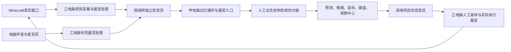

# 第二次实验：完整模型在受限真实环境中的运行

## 实验目标

第二次实验不是只测试视觉、本能或某一条路径。它要让同一个完整人工生命在真实采集、真实大脑、真实输出和真实环境回流中持续运行，观察完整模型能够形成什么能力。Minecraft 只用于把外部现实限制在可控范围内，不是给模型设置游戏分数、目标或任务答案。

## 双电脑整体结构



- 乙电脑负责真实采集、器官侧固定处理、变化传输和实际动作。
- 甲电脑负责人工出生结构、大脑、记忆缓存、情绪器官、预测器官、永久状态和控制台。
- 两台电脑共同承载一个人工生命，不是两个智能体，也没有两个生命时钟。
- 实测局域网最高可用流量按约90MB/s设计，因此视觉和声音先在乙电脑形成器官活动，再只传输工程上发生变化的地址和值。变化地址不进入大脑。

## 真实视觉输入

第二次实验最终接受 Minecraft 客户区为 `1280 × 657`。每个位置只有红、绿、蓝三个活动，因此完整视觉感受场为：

```text
1280 × 657 × 3 = 2,522,880项非负视觉活动
```

器官侧处理顺序：

1. 捕捉真实客户区颜色。
2. 以可运动视野中心为基准进行固定非线性空间变换，输出尺寸仍为 `1280 × 657`。
3. 中心两侧分别归一化，按距离平方映射回原画面；非整数位置取最近原始位置，不平均邻近颜色。
4. 红、绿、蓝三个平面分别进行二维傅里叶变换。
5. 频率半径不大于 `1/256` 的部分归零，`1/256` 到 `1/128` 线性增加到完整保留，不小于 `1/128` 的部分完整保留。
6. 反变换后用固定关系裁剪为 `[0,1]` 非负强度，再形成8位器官活动。
7. 网络只发送变化位置；大脑仍接收每个位置自身的红、绿、蓝活动，不接收“发生变化”标签。

视觉输入不会提前产生实体列表、坐标、边缘、亮度、前后帧差异或识别结果。

## 真实听觉输入

三份声音彼此独立：电脑左声道、电脑右声道、麦克风。没有实体麦克风时，乙电脑安装包提供虚拟麦克风入口，但大脑侧仍保留第三份客观声音流。

- 原始取样率：每秒48,000个取样。
- 每收到192个新取样形成一次新的听觉活动。
- 器官内部固定窗口：最近2,048个取样。
- 频率位置：1,025个。
- 每个位置把二维声音响应 `(x,y)` 保存为三个非负活动。
- 三路合计：`3 × 1,025 × 3 = 9,225`项真实听觉活动。

频率位置和窗口属于客观声音器官，不作为时间数值进入大脑。连续声音反复进入同一组固定受体。

## 输出器官

- 预测视觉：`512 × 512 = 262,144`项灰度活动。
- 预测听觉：`3 × 342 × 85 × 3 = 261,630`项非负活动。
- 鼠标：正横向、负横向、正纵向、负纵向四项连续活动。
- 键盘：108项活动，超过阈值按下，按下后低于阈值松开。
- 视野中心：与鼠标相同的四方向连续活动，但只改变视觉器官中心。
- 当前已确定输出器官控制入口总数：523,890。

教学只接管实际鼠标和键盘输出。教学期间大脑自己的动作倾向仍保存并进入生命信息流。

## 人工出生结构与存储规模

正式三维神经组织：

```text
800 × 800 × 160 = 102,400,000个神经元位置
```

每个位置有26个直接相邻方向，因此底层局部路径槽位为：

```text
102,400,000 × 26 = 2,662,400,000个局部路径槽位
```

第二个实际出生个体的清单记录：

- 固定路径：33,106,609条；
- 情绪器官控制短路径：70条；
- 输出器官末端固定路径：523,890条；
- 路径调制受体记录：2,289,069,086项；
- 基础状态文件：44,750,895,840字节；
- 加入调制受体后的总状态：72,757,813,976字节。

`manifests/fixed_path_structure_manifest.json`来自较早的固定端点编译快照，记录39,585,540对来源—到达端点；`manifests/brain_state_manifest.json`是后来第二个实际出生个体的状态清单。两者数字不同，仓库原样保留，不把不同编译阶段的数字强行合并。

人工出生结构的实际生成代码位于 [`../../source/artificial_dna`](../../source/artificial_dna)。大型神经元、路径和调制数组没有上传。

## 生命值与饱食度本能

参考画面覆盖：

- 满生命值、满饱食度和三格额外饱食度；
- 掉血并失去额外饱食度；
- 掉血并失去普通饱食度；
- 死亡画面。

参考处理不是把画面识别成“满足”“不安”或奖励。具体颜色受体通过人工出生结构中的固定神经元、固定路径和多节汇合结构，到达70个彼此独立的情绪器官控制入口。背景活动通过多受体组合、阈值和路径排列被排除，而不是先运行实体识别器。

实际参考受体、阈值和位置保存在 `manifests/vital_state_center_0_5.json`；对应生成代码位于：

- `source/artificial_dna/vital_state_reference_plan.py`
- `source/artificial_dna/vital_state_neuron_birth_values.py`
- `source/artificial_dna/vital_state_instinct.py`

## 记忆缓存和异步发生

不同信息流独立到达记忆缓存，并按各自入口发送。大脑不使用时钟、帧号或训练轮次。同一客观来源的一项完整活动不能因网络分段或程序数组顺序被拆成多个脑内发生；同一完整发生对同一神经元的多路到达必须先直接相加，再形成该神经元的下一完整状态。

## 实际启动与故障证据

已经实际观察到：

- 乙电脑视觉链路与甲电脑连接运行；
- 教学产生的鼠标和键盘活动到达甲电脑；
- 教学活动进入对应固定接收神经元和后续普通入口；
- 大型个体能够出生并保存；
- 硬盘持续高负载，而显卡利用率较低；
- 停止教学后始终没有观察到实际动作。

动作通道曾发现响应强度被多段连续削弱，随后在第二个新个体的人工出生结构中修正。但最终诊断发现更基础的问题：未公开的大脑运行器把每一项输入变成一次全脑、全路径扫描，并且路径活动每完成一次全量扫描才前进一段。

这相当于错误地给大脑加入“第几次扫描”。它违反项目的异步连续传播理论，也造成巨大硬盘读写。`brain_state_manifest.json`中的 `completed_occurrence_count = 5` 只能视为错误实现留下的硬盘事务记录，不能解释成个体经历了五轮生命活动。

## 当前结论与正确恢复点

第二次实验不能因为没有动作而判定人工出生结构失败，也不能把当前个体当成正式实验结果。恢复工作时必须先重写未公开的大脑本体运行器：

1. 信号到达后只处理受影响的神经元和路径。
2. 所有符合条件的固定路径和可塑路径连续传播。
3. 工程并行批次只负责地址调度，不成为大脑时间。
4. 只持久化真正变化的状态块。
5. 修正后由人工出生结构产生全新个体，再开始正式实验。

## 本目录内容

- `manifests/brain_state_manifest.json`：第二个实际出生个体的完整数组形状和字节清单。
- `manifests/fixed_path_structure_manifest.json`：固定路径端点编译快照。
- `manifests/formal_birth_compilation_status.json`：大型个体出生编译完成记录。
- `manifests/vital_state_center_0_5.json`：生命值/饱食度本能的具体受体和阈值。
- `references`：实际视觉参考处理结果。
